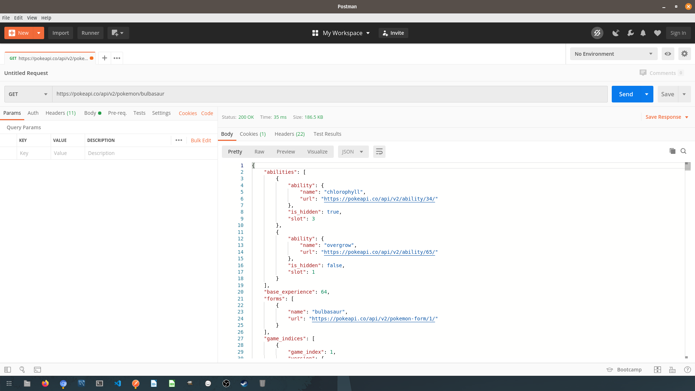
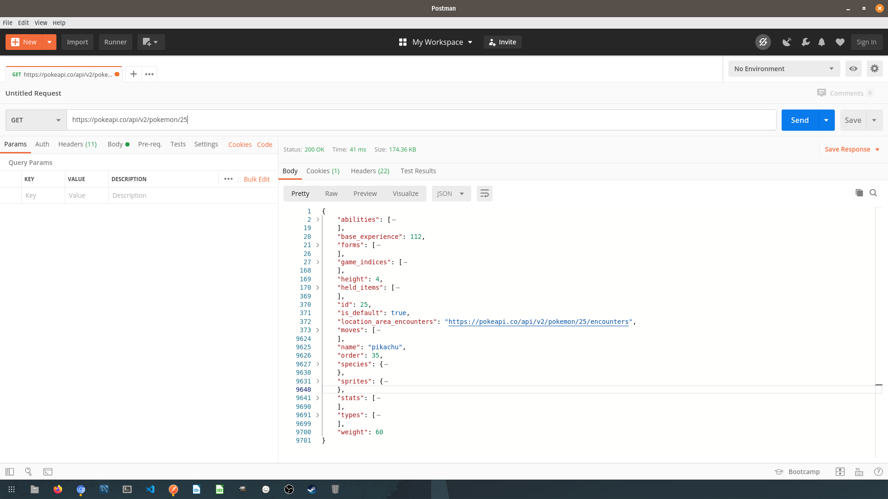

# Postman + Pokemon

With what we just learned, let's go ahead and use Postman with the Pokemon API. Use Postman to perform 5 different GET requests to retrieve 5 different Pokemon of your choice. Here is a link to the [Pokemon API DOCS](https://pokeapi.co/docs/v2)

For instance if we want to find a Pokemon named "Bulbasaur" we could make a request like this.

Or if we want to find a pokemon with an id of 25.

