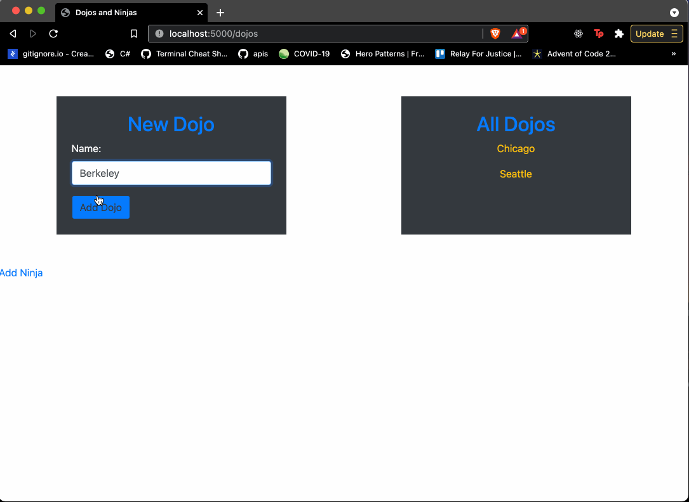
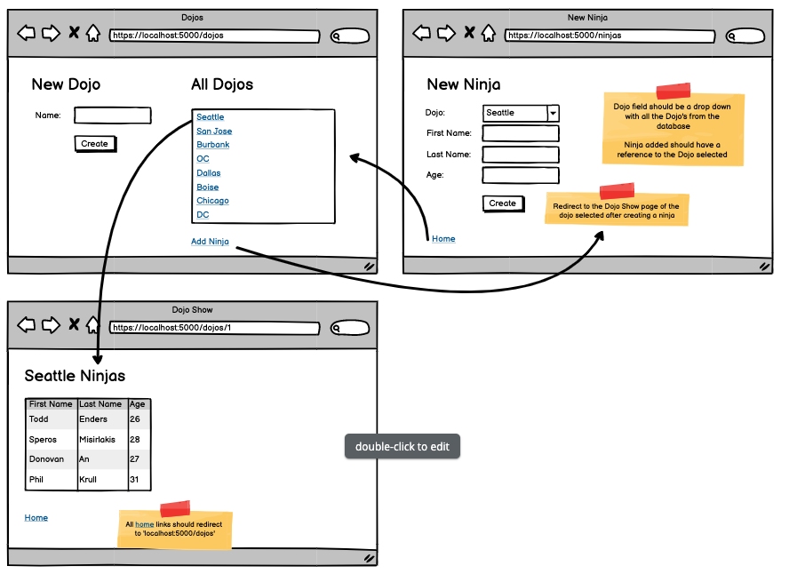

# Dojos and Ninjas
## Objectives:
Practice connecting Flask to database
Practice one-to-many relationships
Practice display and creating data from/into the database

* [ ] Create a new Flask project

* [ ] Use dojos_and_ninjas_schema created in MySQL course

* [ ] `Dojo` page to add a new Dojo and display all Dojos

* [ ] The dojo links on the `Dojo` page should redirect the `Dojo Show` page

* [ ] `Ninja` page to add a new Ninja

* [ ] `Ninja` page should include a drop down menu will all of the dojos in the database

* [ ] Redirect to the `Dojo Show` page of the dojo selected after creating a ninja

* [ ] `Dojo Show` page should display all the Ninjas who are added to the Dojo

* [ ] All Home links should redirect to `localhost:5000/dojos`