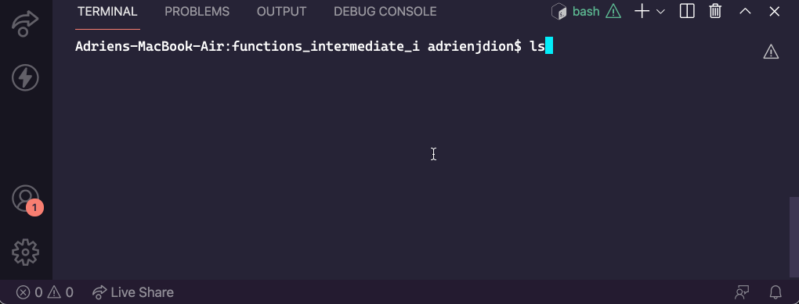

# Assignment: Functions Intermediate I
## Objectives:
Practice writing functions and looping over dictionaries
Achieve a better understanding of how to traverse through a list of dictionaries or through a dictionary of lists
Note: Avoid using class keywords like int, str, list, and dict as variable/parameter names.

1. Update Values in Dictionaries and Lists
```
x = [ [5,2,3], [10,8,9] ] 
students = [
     {'first_name':  'Michael', 'last_name' : 'Jordan'},
     {'first_name' : 'John', 'last_name' : 'Rosales'}
]
sports_directory = {
    'basketball' : ['Kobe', 'Jordan', 'James', 'Curry'],
    'soccer' : ['Messi', 'Ronaldo', 'Rooney']
}
z = [ {'x': 10, 'y': 20} ]
```
   1. Change the value 10 in x to 15. Once you're done, x should now be [ [5,2,3], [15,8,9] ].
   2. Change the last_name of the first student from 'Jordan' to 'Bryant'
   3. In the sports_directory, change 'Messi' to 'Andres'
   4. Change the value 20 in z to 30  


   
  
### Iterate Through a List of Dictionaries
Create a function iterateDictionary(some_list) that, given a list of dictionaries, the function loops through each dictionary in the list and prints each key and the associated value. For example, given the following list:
```
students = [
         {'first_name':  'Michael', 'last_name' : 'Jordan'},
         {'first_name' : 'John', 'last_name' : 'Rosales'},
         {'first_name' : 'Mark', 'last_name' : 'Guillen'},
         {'first_name' : 'KB', 'last_name' : 'Tonel'}
    ]
iterateDictionary(students) 
# should output: (it's okay if each key-value pair ends up on 2 separate lines;
# bonus to get them to appear exactly as below!)
first_name - Michael, last_name - Jordan
first_name - John, last_name - Rosales
first_name - Mark, last_name - Guillen
first_name - KB, last_name - Tonelcopy
```
### Get Values From a List of Dictionaries
Create a function iterateDictionary2(key_name, some_list) that, given a list of dictionaries and a key name, the function prints the value stored in that key for each dictionary. For example, iterateDictionary2('first_name', students) should output:
```
Michael
John
Mark
KB
```
And iterateDictionary2('last_name', students) should output:
```
Jordan
Rosales
Guillen
Tonel
```
### Iterate Through a Dictionary with List Values
Create a function printInfo(some_dict) that given a dictionary whose values are all lists, prints the name of each key along with the size of its list, and then prints the associated values within each key's list. For example:
```
dojo = {
   'locations': ['San Jose', 'Seattle', 'Dallas', 'Chicago', 'Tulsa', 'DC', 'Burbank'],
   'instructors': ['Michael', 'Amy', 'Eduardo', 'Josh', 'Graham', 'Patrick', 'Minh', 'Devon']
}
printInfo(dojo)
# output:
7 LOCATIONS
San Jose
Seattle
Dallas
Chicago
Tulsa
DC
Burbank
    
8 INSTRUCTORS
Michael
Amy
Eduardo
Josh
Graham
Patrick
Minh
Devon
```


1. Update Values in Dictionaries and Lists

2. Iterate Through a List of Dictionaries

3. Get Values From a List of Dictionaries

4. Iterate Through a Dictionary with List Values