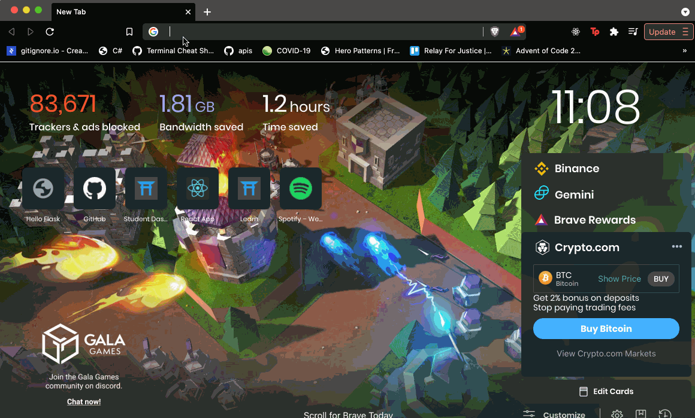

# Assignment: Understanding Routing
## Objectives:
Practice building a server with Flask from scratch
Get comfortable with routes and passing information to the routes

Create a server file that generates the specified responses for the following url requests:

1. localhost:5000/ - have it say "Hello World!"  
2. localhost:5000/dojo - have it say "Dojo!"  
3. Create one url pattern and function that can handle the following examples:  
   * localhost:5000/say/flask - have it say "Hi Flask!"
   * localhost:5000/say/michael - have it say "Hi Michael!"
   * localhost:5000/say/john - have it say "Hi John!"
4. Create one url pattern and function that can handle the following examples (HINT: int() will come in handy! For example int("35") returns 35):
   * localhost:5000/repeat/35/hello - have it say "hello" 35 times
   * localhost:5000/repeat/80/bye - have it say "bye" 80 times
   * localhost:5000/repeat/99/dogs - have it say "dogs" 99 times  

We hope you are feeling more comfortable with routes now!

* [ ] Create a root route ("/") that responds with "Hello World!"

* [ ] Create a route that responds with "Dojo!"

* [ ] Create a route that responds with "Hi" and whatever name is in the URL after /say/

* [ ] Create a route that responds with the given word repeated as many times as specified in the URL

* [ ] NINJA BONUS: Ensure the names provided in the 3rd task are strings

* [ ] NINJA BONUS: For the 4th task, ensure the 2nd element in the URL is an integer, and the 3rd element is a string

* [ ] SENSEI BONUS: Ensure that if the user types in any route other than the ones specified, they receive an error message saying "Sorry! No response. Try again."