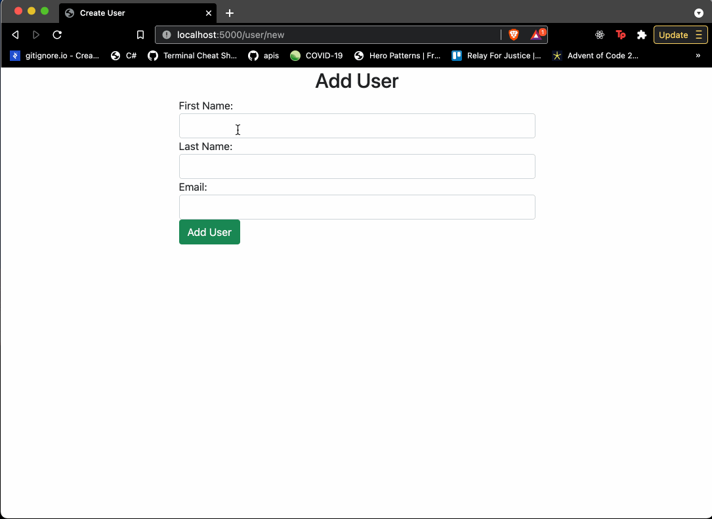
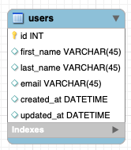

# Users CR
## Objectives:
Practice connecting Flask to database
Practice display and creating data from/into the database

* [ ] 

* [ ] Use the users_schema created in the MySQL course

* [ ] Create a new Flask project

* [ ] Create 2 html pages, Read (All) and Create

* [ ] Display all users from the database on the Read (All) page

* [ ] Display form to create new users on the Create page

* [ ] When the form is submitted, a new user should be inserted into the database

* [ ] Redirect to Read (All) page after creating a new user, and the user just created should appear in the table